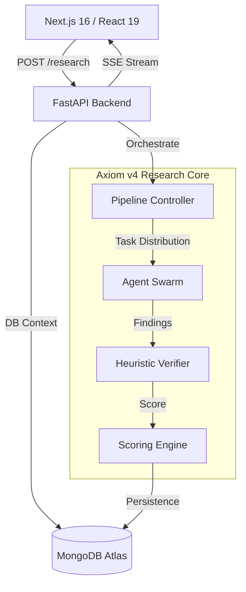

# Axiom — Research Intelligence

Axiom is a high-fidelity, autonomous research engine designed to transform complex inquiries into structured, evidence-based manuscripts. By leveraging a deterministic multi-agent orchestration pipeline, Axiom eliminates the hallucination risks typical of standard LLM interfaces, providing verifiable and cited intelligence in real-time.

---

## 🏗️ System Architecture

Axiom is built on a decoupled, full-stack architecture optimized for high-throughput research and real-time telemetry.



---

## 🧠 The v4 Research Pipeline

Unlike basic RAG (Retrieval-Augmented Generation), Axiom utilizes a **deterministic 5-stage lifecycle** that enforces factual consistency at every layer.

1.  **Architect**: Decomposes the primary goal into a hierarchical investigation roadmap.
2.  **Scout**: Generates high-entropy search queries to traverse academic and technical silos.
3.  **Curator**: Executes parallel retrieval across the open web and private databases, curating sources with raw signal-to-noise filtering.
4.  **Reviewer**: A quality-audit stage that calculates a **Research Coverage Score**. If coverage is insufficient, it triggers a recursive refinement loop.
5.  **Verifier**: Cross-references findings to detect contradictions and verify statistical claims.
6.  **Writer**: Synthesizes the finalized context into a scholarly Markdown report with direct citations.

---

## 🛠️ Engineering Highlights

### 📡 Real-Time Telemetry via SSE
Axiom implements a custom **Server-Sent Events (SSE)** protocol via `ReadableStream` to provide a "live" research experience. Users can observe agent "internal thoughts," sub-queries being processed, and the final manuscript as it is synthesized chunk-by-chunk.

### ⚖️ Multi-Dimensional Scoring Engine
Sources are not just retrieved; they are audited. Our custom `ScoringEngine` applies a weighted heuristic based on:
- **Relevance (40%)**: Semantic alignment with the research goal.
- **Credibility (35%)**: Domain authority tracking (Academic, Govt, News).
- **Recency (25%)**: Temporal decay logic for fast-moving technical fields.

### 🛡️ Fallback Resilience & Rate-Limiting
To ensure 99.9% research completion rates, Axiom utilizes an **Exponential Backoff & Fallback Chain**.
- **Primary**: Google Gemini 1.5 Pro / Flash.
- **Secondary**: Automated pivot to secondary API pools on `429` errors.
- **Tertiary**: Failover to **Groq (Llama 3.1)** on daily quota exhaustion.

---

## 💻 Technical Stack

### Backend (Python)
- **Framework**: FastAPI (Asynchronous execution, Lifespan management)
- **Agent Orchestration**: CrewAI (Specialized roles, Pydantic-enforced outputs)
- **Persistence**: MongoDB (Motor driver for non-blocking I/O)
- **Utilities**: Regex-based `Retry-After` parsing, Trace-ID logging.

### Frontend (TypeScript)
- **Framework**: Next.js 16 (App Router, Server Components)
- **State Management**: Custom React Hooks with `useRef` telemetry buffering.
- **UI/UX**: Framer Motion (Glassmorphism), Tailwind CSS 4 (Jet-Black Noir theme).

---

## 🚀 Quick Start

### 1. Environment Configuration
Create a `.env` in the root:
```env
GEMINI_API_KEY=your_key
SERPER_API_KEY=your_key
MONGODB_URI=your_uri
```

### 2. Launch Services
```bash
# Backend
cd backend && pip install -r requirements.txt && python run.py

# Frontend
cd frontend && npm install && npm run dev
```

---

## 📜 License
Developed under the Axiom Research Initiative. Distributed under the MIT License.
